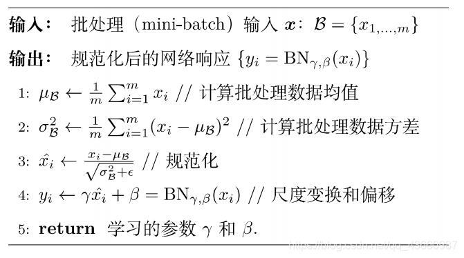
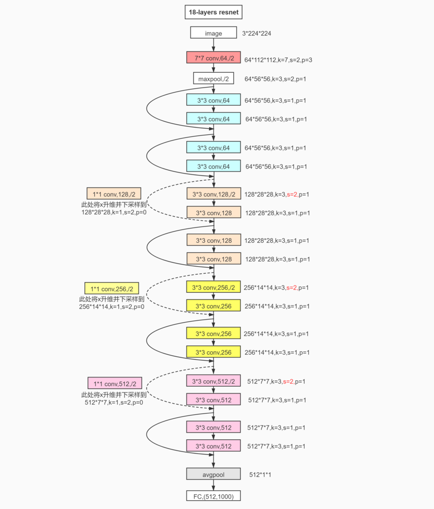
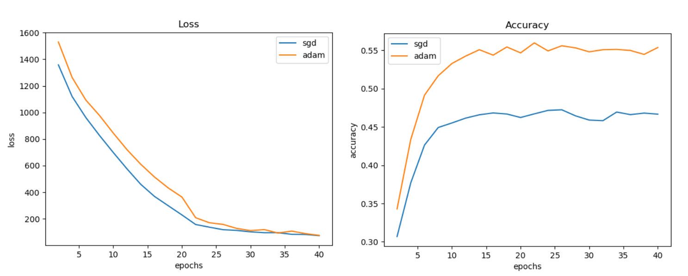
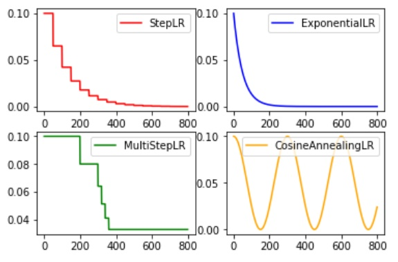

# 第二次大作业：图像分类

## README

### 代码运行

任务1训练：

    python src/main.py -m "Train"

任务1预测：

    python src/main.py -m "Predict"

任务2训练：

    python src/main2.py -m "Train"

任务2预测：

    python src/main2.py -m "Predict"

### 文件组织

+ report/ 报告
+ res/ 结果存储路径
+ save/ 权重存储路径
+ src/ 所有源代码

## 方法介绍

本实验使用了Kaiming H.等于2015年提出的ResNet-18作为网络结构，使用深度学习方法进行训练。

### ResNet-18

在深度学习的应用中，网络的深度对模型的性能至关重要，当增加网络层数后，网络可以进行更加复杂的特征模式的提取，所以当模型更深时理论上可以取得更好的结果。但是，更深的网络其性能一定会更好吗？实验发现深度网络出现了退化问题（Degradation problem）：网络深度增加时，网络准确度出现饱和，甚至出现下降。

#### 残差块

Kaiming H.等提出了**残差学习**来解决退化问题。即：对于一个堆积层结构，当输入为$X$时其学习到的特征记为$H(X)$. 现在我们希望其可以学习到残差$F(X)=H(X)-X$，这样，其实原始的学习特征是$F(X)+X$

残差学习中，一个残差块的结构如图1所示。

 ResNet的核心思想，就是更改了网络结构的学习目的。原本学习的是直接通过卷积得到的图像特征$H(X)$，现在学习的是图像与特征的残差$H(X)-X$，这样更改的原因是因为残差学习相比原始特征的直接学习更加容易。

令
$$
y_l=h(x_l)+F(x_l, W_l)
$$
$$
x_{l+1}=f(y_l)
$$

其中$x_l$和$x_{l+1}$分别是第l个残差单元的输入和输出。每一个残差单元一般包括多个卷积层。$F$是残差函数，表示学习到的残差。$h(x_l)=x_l$表示恒等映射。因此，我们从浅层l到深层L的学习特征为：

$$
x_L = x_l + \sum_{i=l}^{L-1}{F(x_i, W_i)}
$$

利用链式规则，可以求得反向过程的梯度：

$$
\frac{\partial loss}{\partial x_l} = \frac{\partial loss}{\partial x_L} \cdot \frac{\partial x_L}{\partial x_l} 
$$

$$
= \frac{\partial loss}{\partial x_L} \cdot (1+\frac{\partial}{\partial x_l} \sum_{i=L}^{L-1}{F(x_i, W_i)})
$$

式中的$\frac{\partial loss}{\partial x_L}$表示损失函数到达L的梯度。小括号中的1表示短路机制可以无损传播梯度，而另一项残差梯度则需要经过带有权重的层。残差梯度一般不会巧合地使和为-1，因此残差网络不容易引起梯度消失。

也就是说，某种程度上看，残差学习解决了由于网络深度增加引起的梯度消失问题，因此能够有效加深网络的深度，使得结果更好。

### Batch-Normalization

 ResNet-18中使用了批归一化，即Batch Normalization。

Batch Normalization（简称BN），就是对每一批数据进行归一化，以使网络梯度的更新受到样本个别性的影响较小，从而使网络震荡更小，更容易学习到样本中的共同特征。

通常，BN神经网络输入被归一化[0,1]或[-1,1]范围，或者意味着均值为0和方差等于1，即BN对网络的中间层执行白化。下图展示了BN的算法流程

BN对于网络训练的影响可以从两个方面来分析。

首先，BN很好地解决了梯度消失问题，一般网络的非线性函数，比如sigmoid和tanh，其导数在输入绝对值较大时会趋近于0，造成梯度消失。这个区域我们称为“饱和区”。BN把每一层的输出均值和方差规范化，将输出从饱和区拉倒了非饱和区，很好的解决了梯度消失问题。

其次，BN减小了网络输入的大小，从一定程度上也减小了网络参数的大小，起到了网络正则化的效果，有利于提高网络的泛化能力。

### 整体结构

ResNet-18网络的整体结构如下：

最终的全连接层根据目标分类数不同而不同。任务1为20类，任务2为100类。

## 实验过程和结果

利用GPU进行网络训练。为了提高准确率，我们做了如下尝试。

### 优化器

深度神经网络的训练过程需要反向传播梯度，参数在参数空间中顺着负梯度方向移动，使损失函数下降。然而，单纯使用梯度会导致网络陷入鞍点和局部极小值的问题。因此，需要对梯度下降的过程使用优化算法。这就是各种优化器。

**Adagrad**(Adaptive gradient algorithm)，即自适应梯度算法，可以对低频的参数做较大的更新，对高频的做较小的更新。**Adadelta**是对 Adagrad 的改进，将参数学习率除以了过去的梯度平方的衰减平均值，即指数衰减平均值，这样可以减缓Adagrad 学习率急剧下降的问题。**Momentum**在梯度更新中加入了梯度的差分，即动量项。这可以使得梯度方向不变的维度上速度变快，梯度方向有所改变的维度上的更新速度变慢，这样就可以加快收敛并减小震荡。

**Adam**(Adaptive Moment Estimation)，即自适应动量估计。它相当于 RMSprop + Momentum. Adam算法更新梯度的公式如下图

下图为：分别使用Adam和SGD优化器进行训练，准确率和损失函数的变化情况（未使用下文中的其他优化方法）

实验证明，使用同样的初始学习率和其他网络超参数，**Adam优化器可以得到最好的效果**。

### 数据增强

训练集给出的数据是有限的。为了让网络具有更好的泛化效果，需要对有限的数据进行增强。

本次实验中，我们一共使用了两种数据增强的方法。一方面，进行**水平翻转增强**，以0.5的概率将获取的原始图片进行镜像翻转。另一方面，进行**平移增强**，将图片随机向各方向平移0-4个像素，缺失部分用0填充。这两种方法可以使网络学习到镜像和平移的不变性，增强泛化能力。

### 特征图扩大

ResNet网络的残差块使用了下采样，特征图的尺寸随着网络层数的加深不断缩小。但本次任务提供的数据集中，图片尺寸为32×32。使用18层的ResNet，最后四个卷积层的特征图尺寸均为1×1.这样，这几个卷积核就会失去作用，从而变成四个全连接层。同时，较小的特征图包含的信息量也小于较大的特征图，会造成信息损失。

因此，我们通过扩大输入尺寸的方法，进行了**特征图扩大**。在训练时，将输入从32×32扩张到224×224，使用双线性插值来生成大尺寸图片。这样，在全连接层之前的最后数个卷积层，特征图的尺寸就不是1×1而是7×7了。

### 对比试验

在任务1中，针对上述数据增强和特征图增大的方法，我们进行了多次对比实验。实验数据如下。

平移增强 | 水平翻转 | 增大特征图 | 训练轮数 | 准确率
 :--: | :--: | :--: | :--: | :--: | :--: |
$\times$ | $\times$ | $\times$ | 40 | 66.9375% |
$\times$ | $\times$ | $\checkmark$ | 40 | 78.8673% |
$\times$ | $\checkmark$ | $\times$ | 40 | 67.5752% |
$\times$ | $\checkmark$ | $\checkmark$ | 40 | 80.6685% |
$\checkmark$ | $\times$ | $\times$ | 40 | 66.8562% |
$\checkmark$ | $\times$ | $\checkmark$ | 40 | 84.7254% |
$\checkmark$ | $\checkmark$ | $\times$ | 40 | 68.3861% |
$\checkmark$ | $\checkmark$ | $\checkmark$ | 40 | **86.9836%** |

可以看到，数据增强和特征图扩大有效提高了网络准确率。尤其是**特征图扩大**，对提高准确率的效果十分明显。

### 学习率衰减

此外，由于网络随着训练进行会趋于收敛，每一轮迭代使用的学习率也需要相应减小。学习率衰减也有不同的策略，如图所示。

我们的方法使用了指数学习率衰减，即每隔k步将学习率乘以$\gamma$。经过多次实验，我们得出的最佳超参数组合为

$$
\eta_0 = 10^{-3}
$$
$$
\gamma = 0.85
$$

### 最终结果

最终，在20分类任务中，我们在验证集上获取的准确率为**86.9836%**。在100分类任务中，验证集上获取的准确率为**82.0467%**。在测试集上的结果应当与之差别不大。
